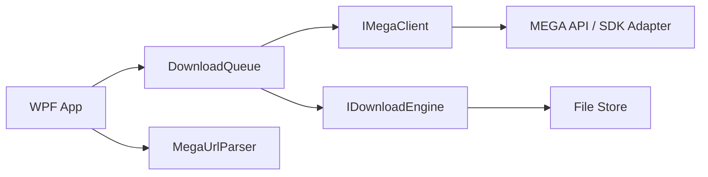

# Clean-Room Development Plan

## Direction

The new app should behave like a modern MEGA download manager, not like a patched copy of the old executable. Keep the old app analysis as a feature inventory only. Do not copy decompiled source, UI text blocks, embedded templates, or private service URLs.

## Current Reference Points

- Official MEGA SDK: https://github.com/meganz/sdk
- MEGA organization: https://github.com/meganz
- MegaApiClient, MIT, used for early folder-link support: https://gpailler.github.io/MegaApiClient/
- Unofficial JS SDK for exploration only: https://mega.js.org/docs/0.17/api
- Old app public listing: https://www.softpedia.com/get/Internet/Download-Managers/MegaDownloader.shtml

## Product Scope

1. Link intake
   - Manual paste.
   - Clipboard watcher.
   - Folder expansion.
   - Optional importers for DLC/ELC-style containers only if we can document the format independently.

2. Download queue
   - Start, pause, resume, stop.
   - Per-file priority.
   - Parallel downloads.
   - Per-file segmented transfer when the transport supports ranges.
   - Retry and backoff.

3. MEGA transport
   - Resolve public file links.
   - Resolve folder links.
   - Decrypt file metadata and content.
   - Validate file integrity when metadata provides enough information.
   - Keep account login optional at first.

4. Desktop shell
   - Queue-first interface.
   - Compact status bar.
   - Inspector for selected item.
   - Settings for download directory, parallelism, proxy, and speed limits.

5. Later features
   - Streaming through a local HTTP server.
   - VLC launch integration.
   - Link hiding in images.
   - Remote web controller.

## Architecture

## Implementation Rules

- Keep transport code behind `IMegaClient` and `IDownloadEngine`.
- Make link parsing deterministic and thoroughly tested before touching network code.
- Prefer official MEGA SDK bindings if they are practical on Windows.
- If using an unofficial library for exploration, treat it as a behavior reference and check its license.
- Avoid embedding third-party service shortcuts or update URLs from the old app.

## Milestones

1. MVP shell: parse links, queue them, persist settings.
2. Public file download: resolve one file, download, decrypt, verify.
3. Queue engine: concurrency, retry, pause/resume.
4. Folder links and import/export.
5. Streaming and remote control.

## Current State

- MVP shell, parsing, public file download, stop/cancel, and two-wide concurrency are implemented.
- Public folder links are expanded into file queue entries using MegaApiClient.
- Pause/resume, persisted settings, retry policy, and official SDK bindings are still pending.
